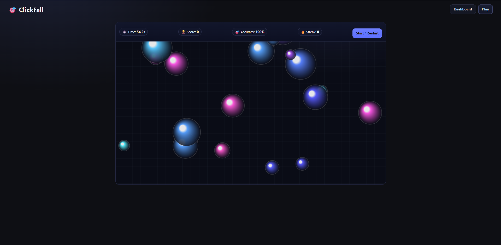

# ClickFall-Pop-Score

A fun browser-based mini game where you test your reflexes and accuracy by pressing keys at the right time. Built with **HTML, CSS, and JavaScript**.

## 🎮 Features

* Real-time key press detection
* Tracks **Score** and **Accuracy**
* Game Over screen with results
* Restart game by **pressing Spacebar** (or by clicking **Play Again** button)

## 🕹️ How to Play

1. Open the game in your browser.
2. Press the correct key when prompted.
3. Each correct press adds to your score. Misses reduce accuracy.
4. When the timer runs out, the Game Over screen shows your final score and accuracy.
5. To restart:

   * Press **Spacebar**, or
   * Click **Play Again**.

## 📂 Project Structure

```
.
├── index.html     # Game layout and UI
├── style.css      # Game styling
├── script.js      # Game logic (start, loop, scoring, game over)
└── README.md      # Project documentation
```

## 🚀 Setup

1. Clone or download this repository.
2. Open `index.html` in your browser.
3. Enjoy the game! 🎉

## 🔧 Technologies Used

* **HTML5** for structure
* **CSS3** for styling
* **JavaScript (Vanilla)** for game logic

Preview Image
-----


---

